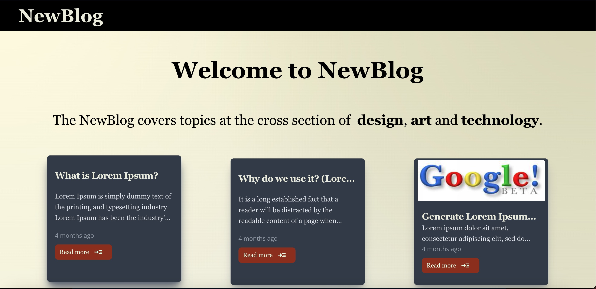
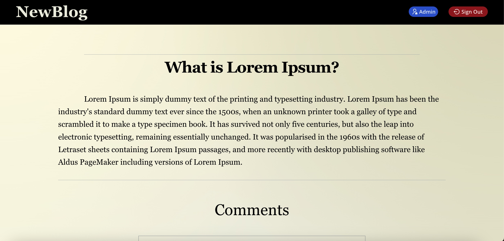

Introducing NewBlog, a dynamic web application that serves as both my GitHub project and a valuable addition to my portfolio. NewBlog was developed as a platform for me to apply and showcase my skills in web development, using a comprehensive stack of technologies including MongoDB, JavaScript, React, Redux, Node.js, Tailwind CSS, and Express.js.

