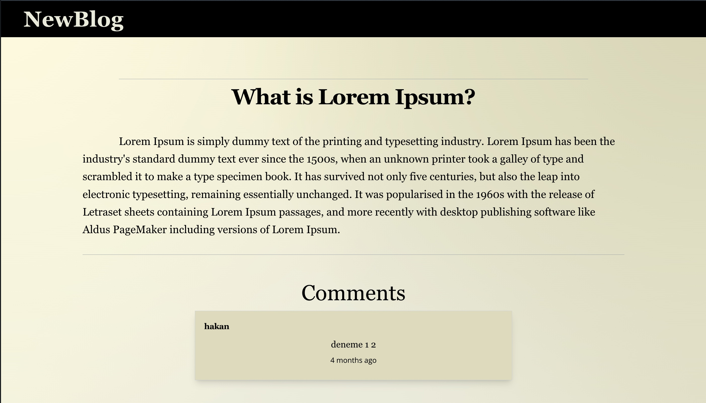

Introducing NewBlog, a dynamic web application that serves as both my GitHub project and a valuable addition to my portfolio. NewBlog was developed as a platform for me to apply and showcase my skills in web development, using a comprehensive stack of technologies including MongoDB, JavaScript, React, Redux, Node.js, Tailwind CSS, and Express.js.

### User Role

As a guest, users can browse through a collection of uploaded articles and engage by leaving comments.

### Admin Role

On the other hand, as an admin, one has the ability to create, update, and delete articles, while also having the power to decide whether user comments should be shared beneath the articles.

Can be logged in as an admin on localhost:3000/admin

email: kesemer@ddd.com

password: 11111111

## :computer: Project Setup

1. Git clone / download the project
2. npm install
3. new terminal+ cd server -- npm start
4. new terminal+ cd client -- npm start

<h2> 🛠 &nbsp;Technologies</h2>

<table style="float:right;">
  <tr>
    <td></td>
    <td></td>
    <td></td>
  </tr>
  <tr>
    <td></td>
    <td></td>
    <td></td>
  </tr>
  <tr>
    <td></td>
    <td> </td>
    <td></td>
  </tr>
  <tr>
    <td></td>
 		<td></td>
    <td></td>
  </tr>
</table>

## :phone: To Contact

 

   
<b> <samp>To Contact </samp></b>

    
   <samp>
   <b><h2 style="color: #fc6203">Onur &nbsp; Hakan &nbsp; PESENER</h2></b>
   
      
      
      
     LinkedIn: <a href="https://www.linkedin.com/in/hakan-p-2713b576/"> LinkedIn Account</a>
      
     Instagram: <a href="https://www.instagram.com/hakanpesener/"> Instagram Account</a>
      
      
     Mail Adress: <a href="#"> hakanpesener@gmail.com</a>
   </samp>
 

